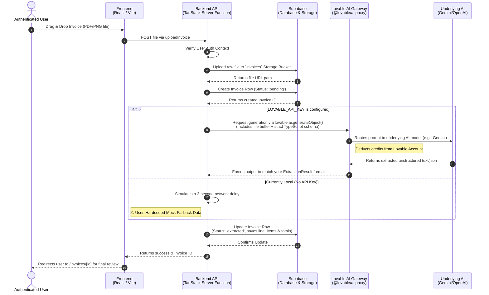

# Invoice Processing Workflow

This diagram illustrates how the Ledgerly application currently processes invoices using the Lovable AI Gateway and Supabase.

### Breakdown of Key Steps:

1. **Upload & Storage (Steps 1-5):** Rather than passing gigantic files directly to the database, your app smartly saves the raw document into **Supabase Storage** first. It immediately creates a "pending" database row so if the AI fails, you don't lose the file record.
2. **The Lovable Routing (Steps 6-9):** The `lovable.ai` package acts as a proxy. It takes your instructions, passes them through Lovable's servers (where they monitor token usage/billing), and then hands it off to an LLM. Because you provided a TypeScript schema, Lovable guarantees the LLM's response won't break your app's frontend forms.
3. **The Mock Engine (Step 10):** Because we didn't want to use up your real credits continuously testing the UI locally, the backend gracefully catches missing API keys and provides dummy data (like "Mock Vendor Inc.") so the development loop never breaks.
